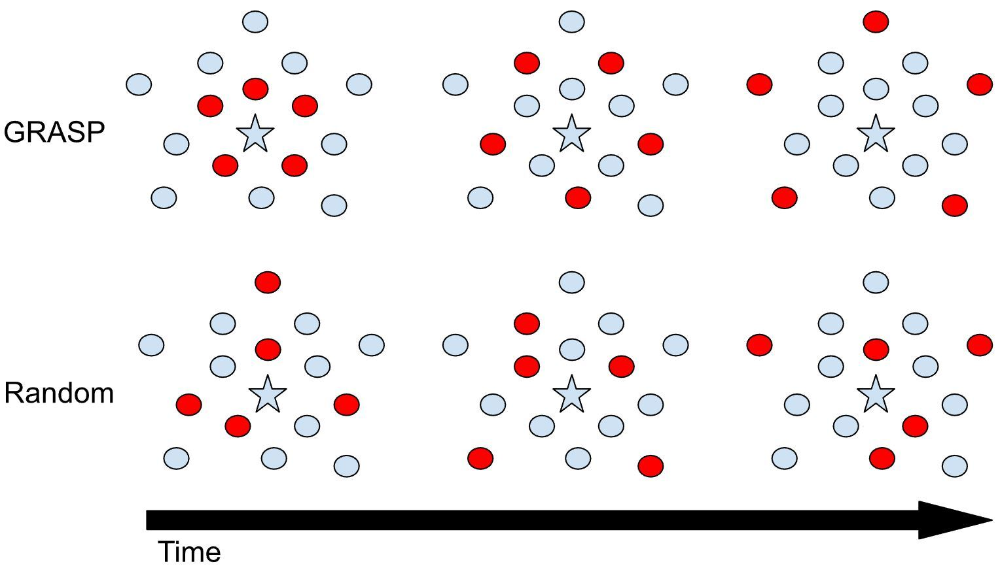

GRASP: A Rehearsal Policy for Efficient Online Continual Learning
=====================================
This is a PyTorch implementation of the GRASP algorithm from our CoLLAs-2024 paper. An [arXiv pre-print](https://arxiv.org/abs/2308.13646) of our paper is available.



GRASP is based on the hypothesis that choosing only easy or hard samples are both suboptimal and that the DNN would benefit from a curriculum that combines both. GRASP first selects the most prototypical (easy) samples from the rehearsal buffer and then gradually selects harder samples, where easy samples are closest to the class mean and hard samples are farthest. We illustrate how GRASP works compared to uniform random policy. Class mean is denoted by ⭐. Selected samples are indicated by 🔴.


## Pre-trained DNNs and OPQ Models
Download pre-trained MobileNetV3-L, MobileViT-Small, and Optimized Product Quantization (OPQ) models form [this link](https://drive.google.com/drive/folders/1gPg_FxsvmUj-Mwis_uASy4qcsKMjzCrJ?usp=share_link).


## Citation
If you find this code useful, please cite our paper.
```
@article{harun2023grasp,
  title     = {GRASP: A Rehearsal Policy for Efficient Online Continual Learning},
  author    = {Harun, Md Yousuf and Gallardo, Jhair and Chen, Junyu and Kanan, Christopher},
  journal   = {arXiv preprint arXiv:2308.13646},
  year      = {2023}
  }
```